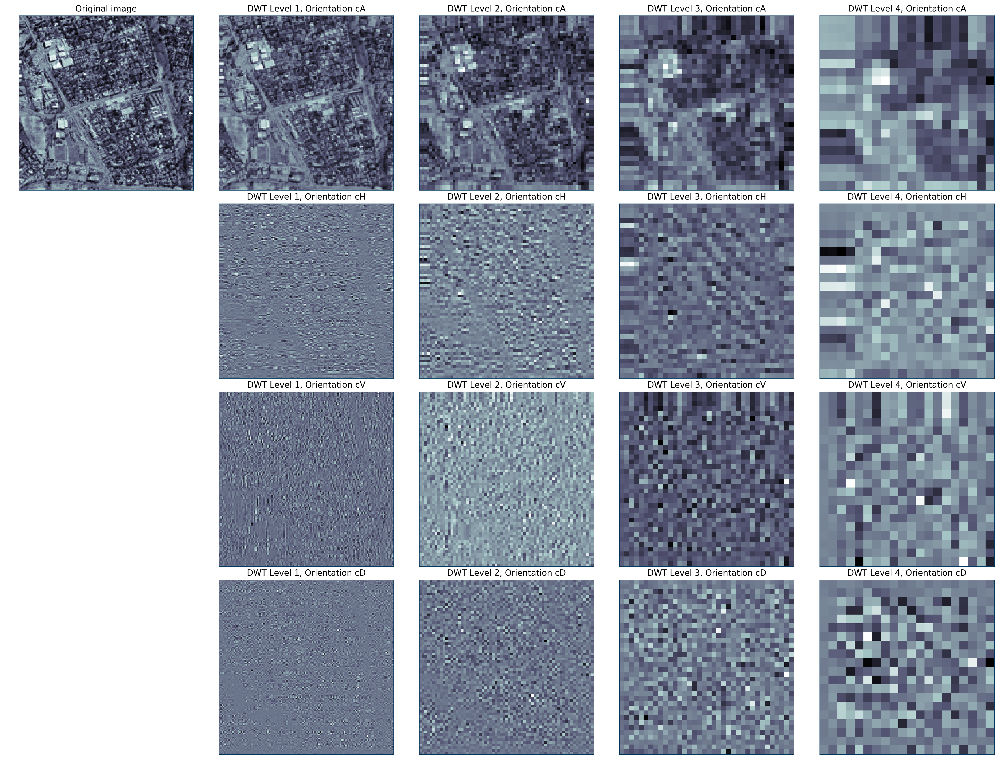

 

# Improve Slum Area Identification through Real-Estate Data (problem 18)

## Friday, February 21, 2020.
https://git.generalassemb.ly/DSI-US-10/project-client-project

## Team members:

|[Michael Ono](https://www.linkedin.com/in/michael-ono/)|[Dylan Blough](https://www.linkedin.com/in/dylan-blough-b2185619a/)|[Neil Hamlett](https://www.linkedin.com/in/neil-hamlett-strategic-quant/)|
|---|---|---|

## Problem Statement. 

Mapping of ***informal settlements*** with satellite imagery is a long-standing practice, but such methods could be enhanced through web-scraped real-estate data. This project would build a web scraper to house and apartment adverts for a selected city in Africa/Latin America/Middle East. The scraper should download all adverts in the city during a recent period (ideally 3 years or more); and map all the adverts. The project should test the feasibility of estimating informal tenure from this information. Using gridded population estimates (e.g. from Facebook), the team would calculate the ratio of real estate adverts with population density. This ratio could serve as an input to machine learning models aimed at mapping informal settlements.

The team selected Johannesburg, SA for purposes of prototyping.  Johannesburg meets multiple criteria.  It is a major population center in a developing economy. This is a client criterion.  For data-availability purposes, SA is the most-developed economy on the Africa continent. 

## Elaboration.

***Informal settlements*** (*aka* "slums") can be defined as " highly populated urban residential area consisting mostly of closely packed, decrepit housing units in a situation of deteriorated or incomplete infrastructure, inhabited primarily by impoverished persons" [Wikipedia](https://en.wikipedia.org/wiki/Slum).  For our purposes *informal settlements* are urban residential concentrations that are not supported by public services.  Beyond infrastructure services, these also include legal status, such as property deeds.

We seek here to identify local concentrations that are not reflected in official or commercial records. Applying a *data-science* approach, we attempt to compare unofficial measurements of local population densities with official or commercial sources. Our "slums" will be localities in which high concentrations of residents are indicated that do not coincide with "official" sources.

Some "ground truth" is available.  A Wikipedia article [*List of slums in South Africa*](https://en.wikipedia.org/wiki/List_of_slums_in_South_Africa) specifically identifies [Alexandra, Gauteng](https://en.wikipedia.org/wiki/Alexandra,_Gauteng) in [Johennesburg](https://en.wikipedia.org/wiki/Johannesburg), our target region.  This area is visually distinct in overhead imagery we use in our analysis.

## Technical Approach.

We apply the [Cross-Industry Standard Process – Data Mining](http://4.bp.blogspot.com/-0iGdZDGnLks/VDA-7DKV_NI/AAAAAAAAAEI/IqYBNniTlZA/s1600/141004%2BFormal%2BMethods%2BComparison.png) (CRISP–DM).  Figure 1 provides an overview.  This method has provided the foundations for delivery methods used by many leading technology firms, including IBM.  

CRISP–DM contains more-direct coupling to the business context than some more data-centric methods.  It also provides more-explicit guidance on iterativity, an inescapable part of modeling.  The following subsections summarize its employment in this project.

#### ***Figure 1*** — Comparison of CRISP–DM method with other data and analytics methods (From [[Hamlett, 2014]](http://quantsprism.blogspot.com/2014/10/getting-value-from-business-analytics.html)).

	 

## Data Understanding, Preparation.

Figure 2 depicts the information architecture for our study.  We fundamentally approach this as a [geospatial-information science (GIS)](https://www.careerexplorer.com/careers/geospatial-information-scientist/) problem. We seek to compare official geospatial population distributions with those obtained from other means.

Our analysis involves fusion of three sources of information.  These are:

⓵ An underlying geopsatial reference frame;

⓶ "Official" population-distribution information; and 

⓷ "Alternative" population-distribution information.

### Geospatial reference frame.

We derive our geospatial reference frame from geo-referenced 

#### Figure 2 — Conceptual information architecture for study.

 

Two types of information sources interest us.  Our basic problem leads us to primarily consider geospatial information sources (GIS). Several sources exist [[EOS, April 19, 2019]](https://eos.com/blog/7-top-free-satellite-imagery-sources-in-2019/) for high-resolution overhead imagery.  Given the proof-of-concept nature of the present study, [Google Earth](https://www.google.com/earth/) is employed.

Overhead imagery downloaded from Google Earth is not geo-referenced.  That is, each pixel is not associated with a distinct longitude (𝘓) and latitude (λ). We employ here a [simple procedure](https://www.youtube.com/watch?v=pVgDyh_YBcI) described in the [*Geo-Spatial Tutorials*](https://www.youtube.com/channel/UCK-8Ky7ZiohkOrHpe6EM1Lw/about) youtube channel.  

This procedure involves adding a limited number of geo-refernced labels to a Google-Earth image. We then use the open-source [QGIS](https://www.qgis.org/en/site/) tool to attribute (𝘓, λ) associations to our labels.  This produces a [GeoTiff](https://earthdata.nasa.gov/esdis/eso/standards-and-references/geotiff) image with an estimated pixel resolution in the range of five to ten meters. Other sources provide resolution as high as one meter.  Our order-of-half-meter resolution suffices for this proof of concept. 

Figure 3 shows Google-Earth image prior to geo-referencing in QGIS.  The yellow-colored thumbtacks  are labeled (𝘓, λ) associations for each point.  We use QGIS' [Georeferencer](https://docs.qgis.org/2.18/en/docs/training_manual/forestry/map_georeferencing.html) plug in to develop an affine transform between pixels and (𝘓, λ) positions on the Earth's surface.
  

#### Figure 3 — Geo-reference-tagged overhead-image download from Google Earth.

 

### *Official* population-distribution data.

South Africa (SA) last conducted a census in 2011 [[stats sa]](http://www.statssa.gov.za).  A *Community-Survey* update was performed in 2016.  Census data is the "most-official" source of information.  It is however most-likely tied to officially-registered residencies. 

SA census data provides population summaries at the administrative subdivision level.  These data represent an SA's attempt to provide an exhaustive measurement of its inhabitants. For our purposes, this source suffers from two shortcomings.  First, it is collected relatively infrequently.  Exhaustive censuses are resource-intensive activities.

Second, the census data records population at a relatively low resolution. We end up with discrete distributions.  We assume constant distribution throughout all area within the boundaries of the administrative subdivision.  

Consequently we cannot perform statistical analysis that is possible with more-granular data. We must treat the population-distribution data within these administrative subdivisions as opaque clusters.  Fortunately, well-established methods exist for comparison with cluster information derived from other sources.  [[Weiss, *et al*, 2010, §5.1]](https://www.springer.com/us/book/9781447125655) describes such an approach in a text-mining context.

### *Alternative* population-distribution data.

We use [Facebook Population-Density Maps](https://dataforgood.fb.com/tools/population-density-maps/) as an alternative source of population-distribution data. We only understand [the provenance of this source in general terms](https://dataforgood.fb.com/docs/methodology-high-resolution-population-density-maps-demographic-estimates/).  

Ostensibly, these distributions are statistically derived from a combination of census data and overhead-imagery processing.  They offer important advantages over the census data, for our purposes.  First, they are updated annually.  Secondly, they purportedly report population distribution at resolution on the order of 30 meters.

Figure 4 contains the overlay of the FaceBook population-density data onto Figure 2, our geospatial reference frame for the Johannesburg, SA region. The red-colored pixels contain all estimates for our region of interest. We have ≳94,000 estimates in this region.

Our quick-and-dirty georeferencing introduced some noise into our image, however. This is the "thumbtack" labels applied using Google Earth.  We exclude these from the portion of the region we process. The light-blue-colored box shows our windowing.  Within this window, we have ≲65,000 measurements.

That narrow unpopulated areas appear in this overlay enhances our confidence in our georeferencing. For example, we do not have population estimates on what appear to be major thoroughfares and golf courses.

#### Figure 4 — Facebook population-distribution measurements within the greater Johennesburg, SA region.

 

### *Commercial*, ad-hoc population-distribution data.

Our problem statement suggested the use of real-estate listings. ....

 

## Approach to modeling.

Figure 2, in addition to representing our our information architecture, makes brief mention of the approach to analysis.  Slum detection is our objective.  We seek to accomplish this using ambient information including population-distribution attributes, and overhead imagery.

For this stage, we use an unsupervised-learning approach.  This is the first step en route to a binary-classification model.  We gain insight into the features that are likely to discriminate between "slums" and non-slums. We seek to compare population clusters in our "ambient" data with those from the "official" measurements.

Making the step towards an actual classification model at this stage seems problematic.  First, we lack extensive ground truth regarding "slums" and non-slums. We have in our region one known-"slum" area, [Alexandra, Gauteng](https://en.wikipedia.org/wiki/Alexandra,_Gauteng). This is insufficient to train a statistical model.  

So, our explanatory-variable set includes the following:

⧐ Features from our Facebook population-density estimates including both geographic (𝘓, λ) and the actual population estimates;

⧐ Features extracted from our overhead imagery.

The geographic (𝘓, λ) variables seek to introduce spatial coherence.  That is, we expect population at one measurement point to be generally correlated with estimates at other points in the vicinity.  

The imagery features capture distinct visible characteristics that may distinguish between slum, non-slum, and other areas. Multiple approaches exist.  The [Fast-Fourier Transform](https://en.wikipedia.org/wiki/Fast_Fourier_transform) (FFT) and [Discrete Wavelet Transform](https://en.wikipedia.org/wiki/Discrete_wavelet_transform) (DWT) are common approaches. 

We use DWT here, because of simplicity advantages. First, many DWT families allow us to work with strictly real numbers. FFTs involve complex values, which we seek to avoid. Secondly, DWTs offer feature-reduction advantages.  Finally, some DWTs provide *perfect-reconstruction* advantages.  This can help with interpretability.

Our *ad hoc* model evaluation seeks to compare results from our unsupervised model with our known administrative-domain data from census data.  Geographic (𝘓, λ) and imagery features probably will not discriminate between administrative boundaries. We do expect it however to discriminate slum areas.  After all, a known slum area is visibly distinct in our Google Maps image.

### Imagery-feature engineering:  Discrete Wavelet Transform (DWT).

We seek to incorporate features from our overhead imagery into our statistical model.  The Discrete Wavelet Transform (DWT) (e.g., [[L. Prasad, S. S. Iyengar, 1997]](https://amzn.to/323O06n)) enjoys widespread use in image-processing applications. Most-prominently, it forms the basis for the [JPEG 2000](https://en.wikipedia.org/wiki/JPEG_2000) and [MPEG](http://www.users.abo.fi/jawester/mpeg4/MPEG4_fundamentals2.pdf) data-compression methods.

#### Figure 5 — Illustration of discrete-wavelet transformation of exemplary image window.

 

-----
-----

# DSI Boilerplate.

## Proposed Deliverables:

⓵ A short write up describing the project, results, and next steps or proposal to scale

⓶ Open source code for full process from gathering data to calculating and mapping the real estate to population density ratio

⓷ Proof of concept or pilot from a city or collection of cities.

## Requirements
For the purposes of a DSI project, you must meet a few technical requirements. They are:

A README.md file in your project repo. Note that README files are automatically rendered by GitHub when you view a repo. Your README should contain:

A problem statement.
A succinct formulation of the question your analysis seeks to answer.
A table of contents, which should indicate which notebook or scripts a stakeholder should start with, and a link to an executive summary.
A paragraph description of the data you used, plus your data acquisition, ingestion, and cleaning steps.
A short description of software requirements (e.g., Pandas, Scikit-learn) required by your analysis.
Your notebook(s) should be reproducible and error-free. This means:

You should set a random seed at the start of every notebook, using np.random.seed(...). This will ensure that the random numbers generated in your notebook will be the same every time.
You need to provide a relative path to your data, so that if I clone your repo to my machine I can run everything in your repo without error. (You also provide links to any publicly accessible data.)
I should be able to Restart & Run All in your notebook(s) and see that the exact same results are reproduced.
To check that everything worked properly, you may consider forking your own repo to a different location on your computer and checking that all notebooks can run properly from top to bottom.
Bear in mind that the value you provide to New Light Technologies may come from data ingestion, data cleaning, EDA, and/ or a dashboard, etc. While a model may not be immediately apparent, be creative. Without us telling you exactly what model to build, how could you build a model to increase performance or generate better insights when answering the problem you are facing?
